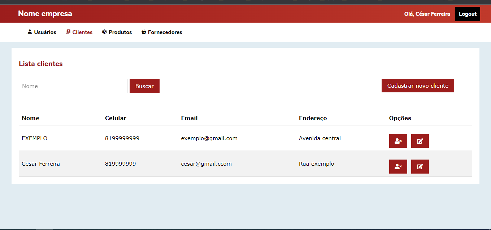
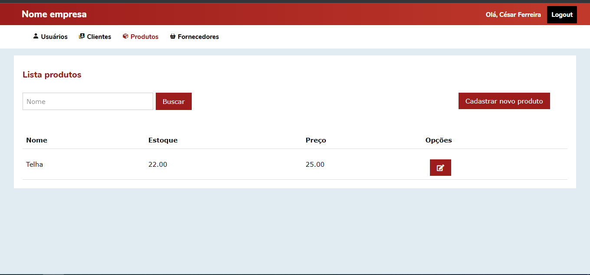
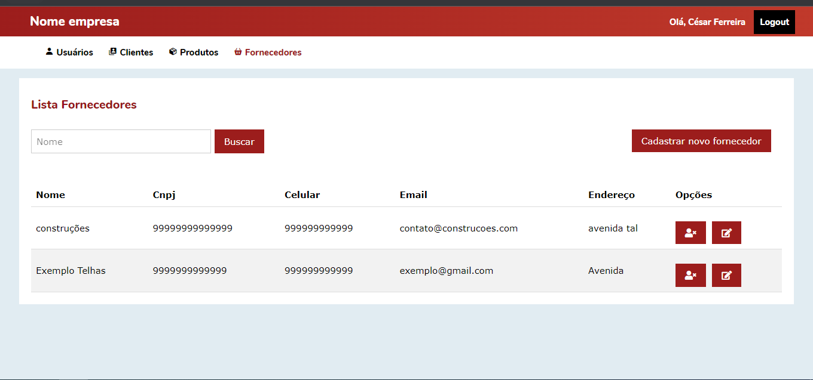
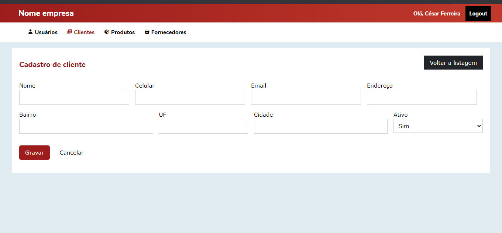
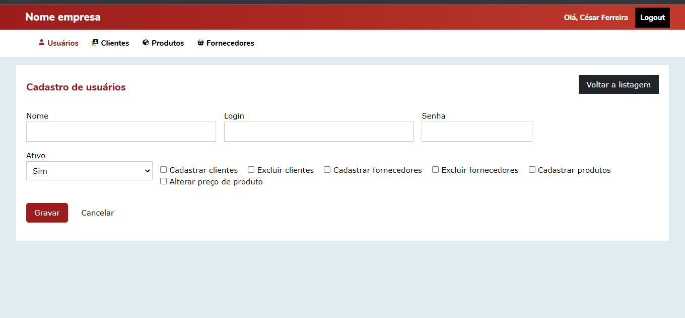
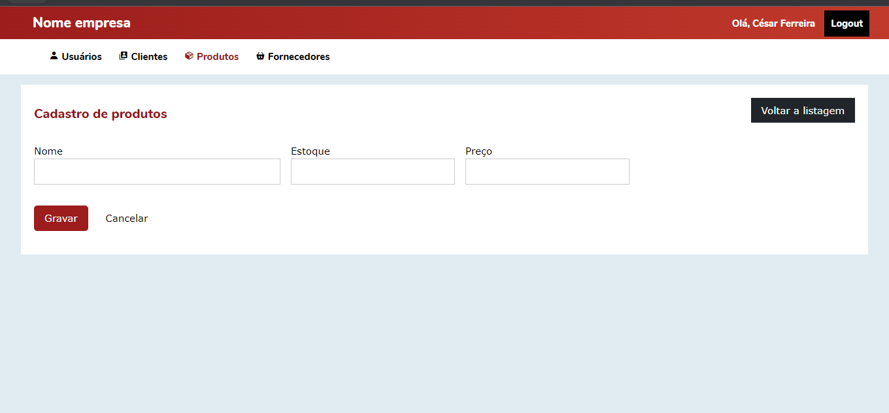

# LojaGerenciadorWeb

Projeto de exemplo de uma loja virtual


## Funcionalidades

- Cadastro de usuários
- Cadastro de clientes
- Cadastro de produtos
- Cadastro de fornecedores
- Controle de permissões funcionando

## Stack utilizada

**Front-end:** Html, css, javascript, jQuery e Ajax

**Back-end:** PHP


## Rodando localmente

Clone o projeto

```bash
  git clone https://github.com/cesar99144/lojaGerenciadorWeb
```

Instale as dependências

```bash
  composer install
```

Inicie o servidor

Devido ao sistema de rotas é preciso fazer uma configuração previa no xampp, wampp
e correlatos, criando um virtual host para o projeto.

Caso for utilizar o servidor do php (o que foi utilizado para o desenvolvimento)
Entre no diretório do projeto pelo cmd e execute o comando: 

```bash
  php -S localhost:8080
```
Caso queira executar em outra porta é preciso alterar o arquivo index do projeto, 
alterando o define("URL_BASE","http://localhost:8080/"); para a url que deseja. Pois com a url base errada os assets e rotas podem não funcionar

https://www.php.net/manual/pt_BR/features.commandline.webserver.php


## Screenshots








